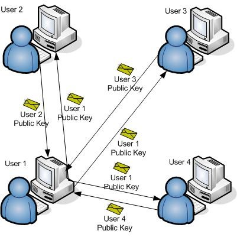
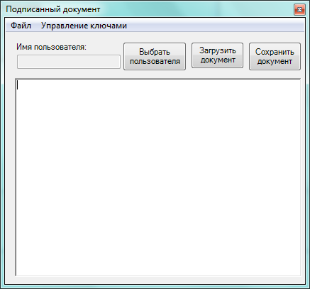
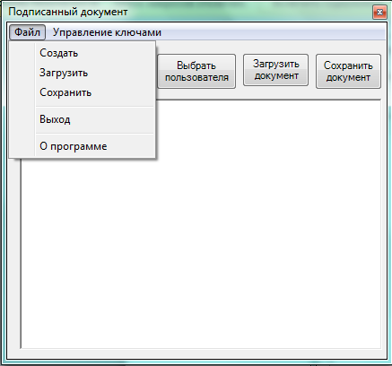
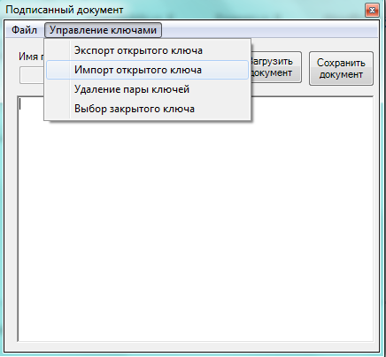

# Прототип системы электронного документооборота
***
## Постановка задачи
* Приложение должно обеспечивать обмен между пользователями подписанными текстовыми документами.
* Приложение должно позволять редактировать текстовые документы, а также сохранять и загружать их вместе с электронной 
  подписью.
* Для проверки подписи в приложении необходимо обеспечить хранение открытых ключей всех участников обмена сообщениями, 
  поэтому должны быть реализованы функции импорта/экспорта открытых ключей пользователей.
* Все открытые ключи из хранилища должны быть защищены от изменения и подмены с помощью электронной подписи пользователя
  при импорте такого ключа.
  

Схема распределения ключей в системе при подключении к ней нового пользователя

## Пользовательский интерфейс
1.  Редактируемая строка под надписью «Имя пользователя» предназначена для ввода имени контейнера ключей криптопровайдера
   пользователя, который обеспечивает хранение пары асимметричных ключей электронной подписи (пока имя контейнера ключей
   не задано, работа приложения с подписанными документами невозможна). Поле с текстовым редактором под редактируемой 
   строкой предназначено для ввода и редактирования текстов подписанных документов. Кнопка «Выбрать пользователя» на 
   главной форме используется для переключения на новый контейнер ключей (нового пользователя). Эта кнопка дублирует 
   команду «Выбор закрытого ключа» меню «Управление ключами». Кнопки «Загрузить документ» и «Сохранить документ» 
   дублируют команды «Загрузить» и «Сохранить» меню «Файл».
  
2. Команда «Создать» меню «Файл» предназначена для создания нового документа (очищается содержимое поля с текстовым 
   редактором, а в заголовок формы помещается текст «Подписанный документ»).
   
3. Команда «Сохранить» меню «Файл» предназначена для сохранения созданного (отредактированного) документа в виде массива
   байт вместе с вычисляемой электронной подписью и именем автора документа в папке и файле (рекомендуется с расширением
   sd), выбираемыми пользователем. Структура подписанного документа приведена в <u>**Таблице 2**</u>. Алгоритмы 
   электронной подписи и хеширования массива байт документа выбираются из <u>**Таблицы 1**</u>.

### Пример главной формы и интерфейса приложения   

Пример главной формы приложения

Пример состава меню "Файл" приложения

Пример состава меню "Управление ключами" приложения

4.  Команда «Загрузить» меню «Файл» предназначена для чтения подписанного документа из папки и файла, выбираемых
    пользователем, извлечения из документа имени его автора, нахождения открытого ключа автора документа в хранилище
    открытых ключей (например, в папке с именем PK, находящейся внутри папки с приложением), проверки подписи
    пользователя под открытым ключом, извлечения и проверки подписи автора под документом и отображением текста
    проверенного документа в поле с текстовым редактором на главной форме. Имя автора проверенного документа должно
    отображаться в заголовке главной формы после слов «Подписанный документ». Если документ с заданным именем не найден,
    отсутствует открытый ключ автора документа (он не был предварительно импортирован), не подтверждаются подписи под
    открытым ключом или документом, приложение должно выводить соответствующие сообщения.
    
5.  Команда «Выход» меню «Файл» предназначена для завершения работы приложения. Команда «О программе» меню «Файл» 
   предназначена для вывода формы с информацией об авторе приложения (фамилии и инициалах студента, номере учебной 
   группы и номере варианта).
   
6.  Команда «Экспорт открытого ключа» меню «Управление ключами» предназначена для сохранения открытого ключа в виде
   массива байт в файле с именем владельца ключа (участника системы электронного документооборота) и расширением pub. 
   Папка для файла с экспортируемым открытым ключом выбирается пользователем. Формат открытого ключа при экспорте 
   приведен в <u>**Таблице 3**</u>.
   
7.  Команда «Импорт открытого ключа» меню «Управление ключами» предназначена для чтения файла с ранее экспортированным 
   открытым ключом (имя папки и файла выбираются пользователем), подписания считанных данных с помощью закрытого ключа 
   пользователя и сохранения подписанного открытого ключа в папке-хранилище открытых ключей участников электронного 
   документооборота (например, в папке с именем PK, находящейся внутри папки с приложением). Формат подписанного 
   открытого ключа приведен в <u>**Таблице 4**</u>. Функция импорта открытого ключа позволяет также импортировать уже 
   подписанные ключи из хранилища открытых ключей с заменой старой подписи под ключом на заново вычисленную. 
    Алгоритмы электронной подписи и хеширования массива байт открытого ключа выбираются из <u>**Таблицы 1**</u> в 
    соответствии с номером варианта студента.
   
8.  Команда «Удаление пары ключей» меню «Управление ключами» предназначена для удаления пары асимметричных ключей 
   электронной подписи пользователя из его контейнера в криптопровайдере и очистки редактируемой строки с именем 
   пользователя.
   
9.  Команда «Выбор закрытого ключа» меню «Управление ключами» предназначена для разблокирования редактируемой строки 
   для ввода имени пользователя (имени его контейнера ключей) и перевода фокуса ввода на эту строку. После ввода имени 
   пользователя редактируемая строка блокируется.
   
10. После завершения разработки приложения провести его тестирование. Рекомендуемый порядок действий при тестировании:
    * задать имя пользователя для себя;
    * создать небольшой текстовый документ и сохранить его;
    * экспортировать свой открытый ключ и импортировать его себе для того, чтобы иметь возможность читать и 
      редактировать свои документы;
    * передать файл со своим открытым ключом другим пользователям;
    * получить другие файлы экспортируемых открытых ключей и импортировать открытые ключи других пользователей себе;
    * получить и прочитать документы других пользователей;
    * удалить свою ключевую пару. 

**<u>Таблица 1</u>**

| Алгоритм хеширования документа | Алгоритм подписи документа | Алгоритм хеширования открытого ключа | Алгоритм подписи открытого ключа |
| :----------------------------: |:--------------------------:| :-----------------------------------:| :------------------------------: |
|              MD5               |            RSA             |                 SHA512               |                RSA               |

**<u>Таблица 2</u>**\
Структура подписанного документа

| Длинна имени подписывающего пользователя | Длина подписи | Имя подписывающего пользователя | Электронная подпись | Текст документа |
| :--------------------------------------: |:-------------:| :------------------------------:| :-----------------: | :--------------:|

**<u>Таблица 3</u>**\
Формат открытого ключа

| Длинна имени владельца открытого ключа | Длина блоба с открытым ключом | Имя владельца открытого ключа | Блоб с открытым ключом | 
| :------------------------------------: |:-----------------------------:| :----------------------------:| :--------------------: |

**<u>Таблица 4</u>**\
Формат подписанного открытого ключа

| Длинна имени владельца открытого ключа | Длина блоба с открытым ключом | Имя владельца открытого ключа | Блоб с открытым ключом | Электронная подпись |
| :------------------------------------: |:-----------------------------:| :----------------------------:| :--------------------: | :------------------:|

